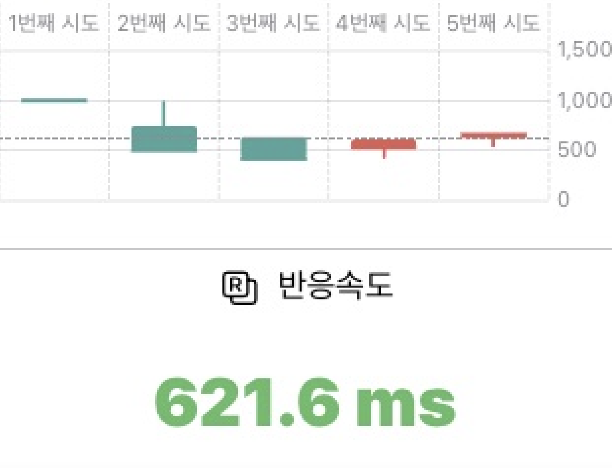
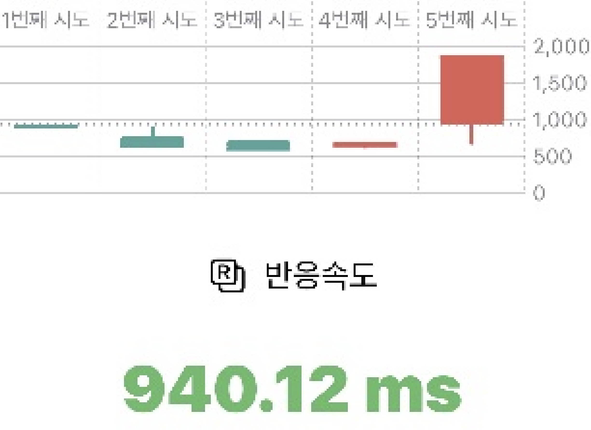

# AsyncImageRenderer


For `ImageRenderer` included in `SwiftUI`, scale is set to `1`.   
It's very blurry. Fixed this.


|AsyncImageRenderer|ImageRenderer|
|------|---|
|||
|Fixed|Original|


## Example
```swift
import AsyncImageRenderer

Task {
  if let renderedImage = await AsyncImageRenderer.image(ContentView())
    // 
  }
}
```

## Installation
### Swift Package Manager

The [Swift Package Manager](https://swift.org/package-manager/) is a tool for automating the distribution of Swift code and is integrated into the `swift` compiler. 

Once you have your Swift package set up, adding Alamofire as a dependency is as easy as adding it to the `dependencies` value of your `Package.swift`.

```swift
dependencies: [
    .package(url: "https://github.com/swift-man/AsyncImageRenderer.git", .from: "0.5.0")
]
```
